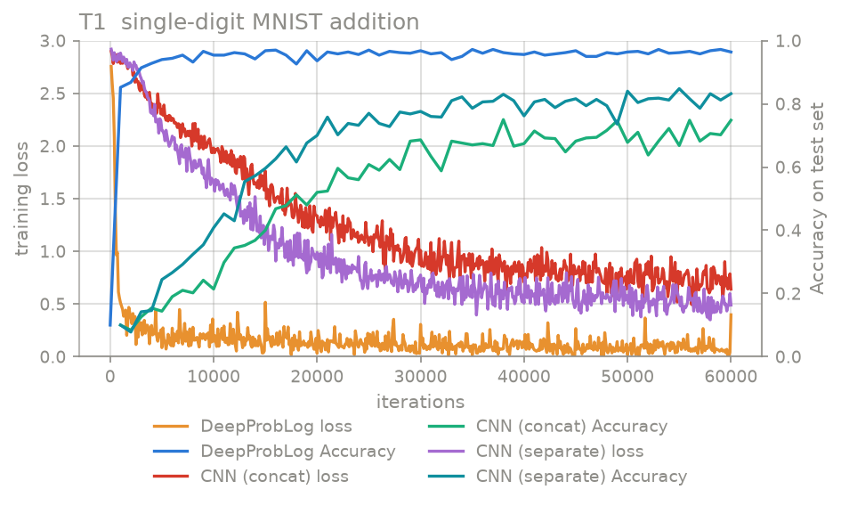
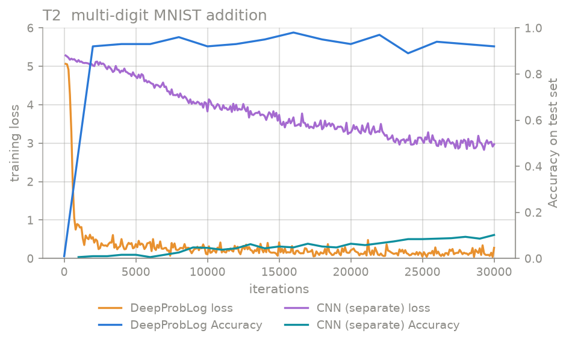
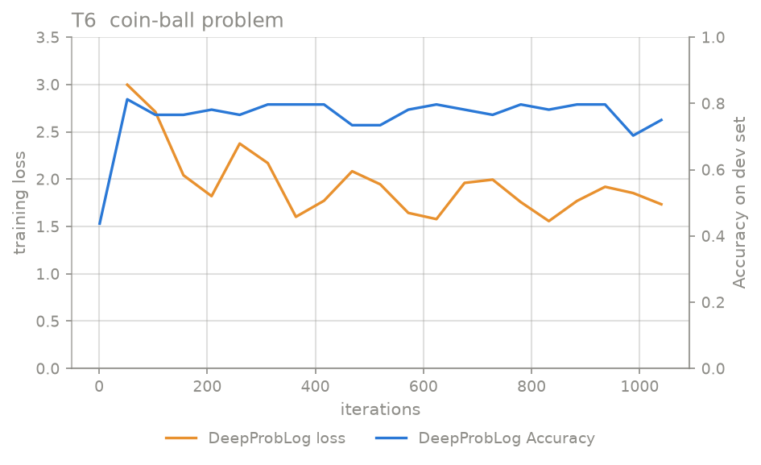
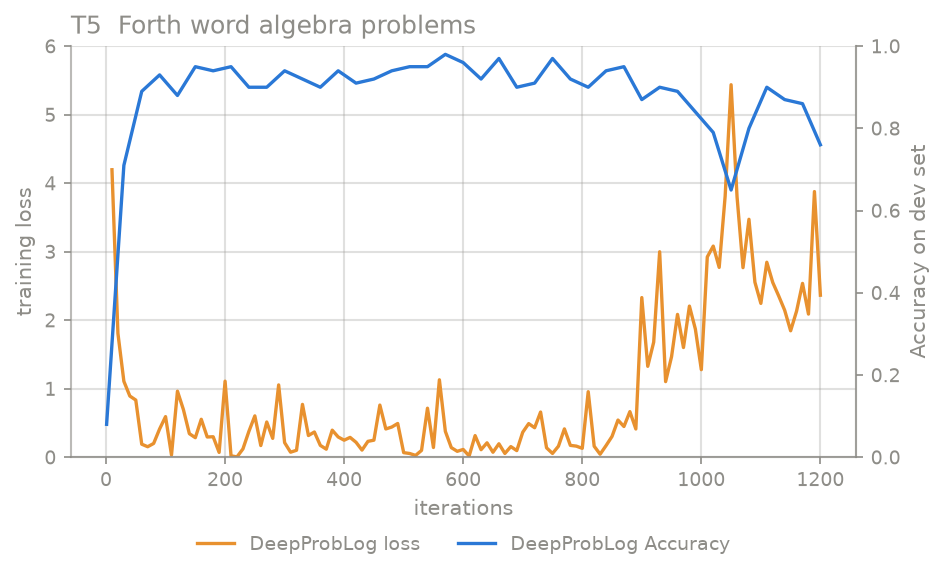

# DeepProbLog Reproduction

Reproducing all six experiments of Manhaeve et al., *DeepProbLog: Neural
Probabilistic Logic Programming*, NeurIPS 2018
([paper](https://arxiv.org/abs/1805.10872)), on top of the official
[ML-KULeuven/deepproblog](https://github.com/ML-KULeuven/deepproblog)
library installed as an ordinary pip dependency — nothing vendored.
Write-up: [shaoweizhang1.github.io](https://shaoweizhang1.github.io).

## Results

Five of the six come out. Every number below is the `#Accuracy` line of
the matching `deepproblog_demo/log/*.log` -- the final model on T1 and T2,
the best-on-dev checkpoint on T3 to T6.

| Task | Mine | Paper |
|---|---|---|
| T1 single-digit addition | **96.6%** | ~97% |
| T1 CNN baseline (separate / concat) | 85.9% / 75.4% | both below DeepProbLog |
| T2 multi-digit addition | **92.4%** | somewhat below T1 |
| T2 CNN baseline | 13.0% | does not generalise |
| T3 Forth addition, 6 cells | 100.0 ×5, 97.7 ×1 | 100.0 |
| T4 Forth sorting, 10 cells | **100.0 ×10** | 100.0 |
| T5 word algebra problems | **97.5%** | 96–97% |
| T6 coin-ball | 81.2% | 100% |

<p align="center">


</p>

The curves are evaluated on 500 test examples every thousand iterations,
cheap enough to run sixty times; the table is the full test set at the end
(`--test_subset` sets the first, the `#Accuracy` line reports the second).
That is why a curve can land a couple of points off its table entry.

The right-hand axis is accuracy. The paper's Figure 3 labels the same axis
*Accuracy* and then calls it "F1 score on the test set" in the caption, so
every log here carries both `#F1` and `#Accuracy`, and the figures above
plot the one the axis asks for.

### The paper's Table 1a — the grid

T3 and T4 are a grid, not a number: each cell is a model trained on inputs
of one length and tested on a longer one. Sorting, accuracy %:

| System | Test length | train 2 | 3 | 4 | 5 | 6 |
|---|---|---|---|---|---|---|
| ∂4 (paper) | 8 | 100.0 | 100.0 | 49.2 | – | – |
| ∂4 (paper) | 64 | 100.0 | 100.0 | 20.6 | – | – |
| DeepProbLog (paper) | 8 / 64 | 100.0 | 100.0 | 100.0 | 100.0 | 100.0 |
| **DeepProbLog (mine)** | **8 / 64** | **100.0** | **100.0** | **100.0** | **100.0** | **100.0** |

Addition, accuracy %:

| System | Test length | train 2 | train 4 | train 8 |
|---|---|---|---|---|
| DeepProbLog (paper) | 8 / 64 | 100.0 | 100.0 | 100.0 |
| **DeepProbLog (mine)** | **8** | **97.7** | **100.0** | **100.0** |
| **DeepProbLog (mine)** | **64** | **100.0** | **100.0** | **100.0** |

∂4 numbers are quoted from the paper, which quotes them in turn from
Bošnjak et al. (2017); `–` is where that paper reports nothing. The 97.7
cell hit 100.0 on an earlier run of the same configuration, so it is seed
variance.

### The paper's Table 1b — wall clock

Seconds until 100% accurate on test length 8:

| | train 2 | 3 | 4 | 5 | 6 |
|---|---|---|---|---|---|
| ∂4 on GPU (paper) | 42 | 160 | – | – | – |
| ∂4 on CPU (paper) | 61 | 390 | – | – | – |
| DeepProbLog on CPU (paper) | 11 | 14 | 32 | 114 | 245 |
| **DeepProbLog on CPU (mine)** | **9** | **19** | **41** | **139** | **1156** |

Four of the five land within a factor of about 1.3 of the published
numbers. The last is 4.7× off; the machine was heavily loaded and the work
is single-threaded CPU, so read the trend rather than the number.

### T6 does not reproduce

The paper reports 100% after 5 epochs; this gets 81.2%, with the colour
network at 18.8%, below chance for three classes. The reasons are upstream
of the code:

- **No released implementation.** The repository's nearest example is a
  different task — two coins in one image, no learnable probabilistic
  parameters. Program, data and runner are all reconstructed here.
- **Listing 6 of the paper does not run as printed.** It needs repairs
  before ProbLog accepts it; `src/experiments/t6/coin_ball.pl` documents
  each one.
- **The data does not exist, and the missing part is the answer.** The
  paper never states the urn ratios or the coin bias its training set is
  drawn from — exactly the quantity the experiment claims to recover.
  `coin_ball_data.py` picks its own, so success means "training found the
  numbers I chose".

<p align="center">

</p>

## Three things the paper does not mention

**Training is not monotone, and it is not overfitting.** T3–T6 all reach a
good solution and then get worse if training continues. The clearest case
is in the logs: on T5 the best-on-dev checkpoint scores 97.5% on test and
the model the last epoch left behind scores 74.0% — one run, 23 points
apart.

<p align="center">

</p>

Dev accuracy peaks at 98% on iteration 570 and bounces between 90 and 97
for three hundred more. At 900 the training loss goes from a few tenths to
two or three and never comes back, and accuracy follows it down to 76.
The cause is the probabilistic parameters collapsing onto 0 and 1: a
parameter at zero switches off a branch of the program, and any network
whose only gradient came through that branch stops receiving one.
Re-normalising the AD does not prevent it — 0 and 1 is a normalised
distribution. Every task here therefore selects its checkpoint on a dev
set instead of burning a fixed epoch budget.

**It is CPU-bound, and the GPU makes it slower.** A T1 iteration spends
almost all its time grounding, compiling and evaluating a circuit, none of
which leaves the CPU. Putting the networks on a GPU measured slower, not
faster: the semiring reads every neural probability back with `float(...)`,
and each of those is a device synchronisation. Torch's default intra-op
threading is a trap at this tensor size too — one thread beat all cores.

**Evaluation can cost more than training.** A test query leaves the answer
unbound, so its circuit covers every possible answer: 19 sums on T1, 199
on T2. A T2 query costs far more than a T1 one as a result — enough that
keeping T1's evaluation cadence on T2 would have spent longer evaluating
than training. Batching does not help — the paper says so itself:
"We do not perform actual mini-batching, but instead use gradient
accumulation."

## Reconstructions and deviations

Three places where this repository does not simply run official code.

**T1's concatenation CNN was rebuilt.** The library ships only the
shared-encoder baseline; the CNN the paper plots — one set of
convolutional layers over both images at once — is not there. The two
images are stacked as channels, which keeps the 16×4×4 feature map the
described architecture implies; laying them side by side would give
16×4×11 and a first linear layer of 84,600 parameters, nearly twice the
whole network. The appendix's "44k parameters" is the digit network
(1 channel, 10 outputs, 44,426 here); this baseline is the same trunk with
2 channels and 19 outputs, 45,341.

**T4 uses lr 0.1, not the official 1.0.** The official sorting script's
1.0 never solved the task over three runs here; 0.1 solved it in all
three.

**T6 runs 20 epochs, not the paper's 5.** Nothing here is at 100% by 5,
and dev accuracy is flat well before 20.

T1 and T2 also run 60000 and 30000 iterations rather than the paper's
30000: the concat baseline and DeepProbLog were both still climbing at
30000. The separate baseline was not — it ends slightly lower at 60000
than at 30000. Those shorter runs are kept in `log/archive/`.

## Layout

```
problog_demo/            standalone ProbLog programs, unrelated to DeepProbLog
                         (own README)
deepproblog_demo/
  commands/              one .sh per step; hyperparameters live here, not in src/
  src/experiments/       t1 … t6
  src/utils/             paths, CLI parsers, shared training loops
  src/plotting/          log/*.log -> figs/*.png
  data/                  only what the pip package does not ship
  log/  figs/
```

| Task | Commands | Logs |
|---|---|---|
| T1 single-digit MNIST addition | `t1_deepproblog.sh`, `t1_baseline.sh` | 3 |
| T2 multi-digit MNIST addition | `t2_deepproblog.sh`, `t2_baseline.sh` | 2 |
| T3 Forth addition sketch | `t3_deepproblog.sh` | 6 |
| T4 Forth sorting sketch | `t4_deepproblog.sh` | 10 |
| T5 Forth word algebra problems | `t5_deepproblog.sh` | 1 |
| T6 coin-ball | `t6_deepproblog.sh` | 1 |

## Running

```bash
pip install -r requirements.txt
cd deepproblog_demo
bash commands/t1_deepproblog.sh
bash commands/plot_all.sh          # figs/*.png
```

Everything runs on CPU. A `--device cuda` flag exists but measured slower;
see above.

## Attribution

All inference is the official library. Where a module here is adapted from
an official example, its header names the upstream file and lists how it
deviates; where there is no upstream — T1's concatenation CNN, all of T6 —
the header says so and cites the paragraph of the paper it was built from.
A few plain-text data files are copied in because the pip package ships
only `.py` and `.pl`; `deepproblog_demo/data/README.md` lists each one.
